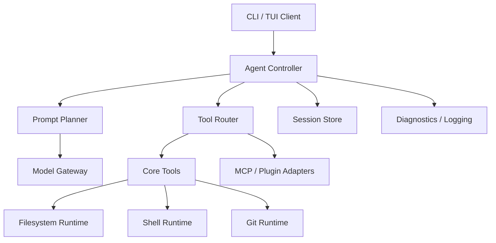

# Architecture Blueprint for KCode

## 1. High-Level Architecture

## 2. Core Modules

### 2.1 CLI Layer
- Commands: `init`, `chat`, `run`, `config`, `doctor`, `serve` (future).
- Accepts flags for model, workspace, approval mode, and non-interactive execution.

### 2.2 Config System
- Load order: env vars -> user config -> workspace config -> CLI flags.
- JSON schema versioned and validated.
- Secrets never written into session logs.

### 2.3 Model Gateway
- Unified message/tool-call interface.
- Adapters for OpenAI-compatible, Anthropic-compatible, local/self-hosted endpoints.
- Streaming, retries, backoff, token accounting, and abort support.

### 2.4 Agent Controller
- Implements observe-think-act loop.
- Maintains short-term working memory and long-term session state.
- Supports compaction/summarization when context grows.
- Enforces tool budget, token budget, and step budget.

### 2.5 Tool Layer
- Tool contract: `{name, description, parameters, safety_class, execute(context, input)}`
- Built-in tools:
  - `read_file`
  - `create_file`
  - `edit_file`
  - `list_files`
  - `search_code`
  - `run_command`
  - `git_status`
  - `git_diff`
  - `git_commit`
  - `web_fetch`
- Execution classification:
  - read-only
  - write
  - system
  - network

### 2.6 Runtime Adapters
- **Filesystem adapter**: Windows-first, safe path normalization, symlink awareness, size limits.
- **Shell adapter**: PowerShell-compatible command runner with allowlist/blocklist and timeout.
- **Git adapter**: porcelain command abstraction with structured output.

### 2.7 Session & Persistence
- SQLite-backed sessions, messages, tool runs, and diffs.
- Replayable audit trail.
- Export/import workspace bundles (future).

### 2.8 Observability
- Structured JSON logger.
- Debug logs for prompts, tool inputs, tool outputs, latency, and errors.
- Redaction layer for secrets.

## 3. Quality Architecture

### Testing layers
1. **Unit tests** for planner, parser, tool registry, config loader.
2. **Integration tests** for CLI commands and agent round trips.
3. **Golden tests** for prompts and tool schemas.
4. **Smoke tests** for model/runtime adapters behind feature flags.

### Reliability requirements
- Deterministic tool schema output.
- Crash-safe session persistence.
- Graceful abort for long-running commands.
- Clear error taxonomy: config error, runtime error, tool error, model error, policy error.

## 4. Non-Goals for v1
- Full web UI.
- Multi-agent distributed orchestration.
- Unmanaged plugin marketplace.
- Automatic production deployment service.

## 5. Milestone Architecture
- **v0.1**: CLI + config + model adapter + read-only tools.
- **v0.2**: edit/create/search/command tools + audit logging.
- **v0.3**: session persistence + summarization + test suite.
- **v0.4**: MCP adapter interface + docs + packaging.
